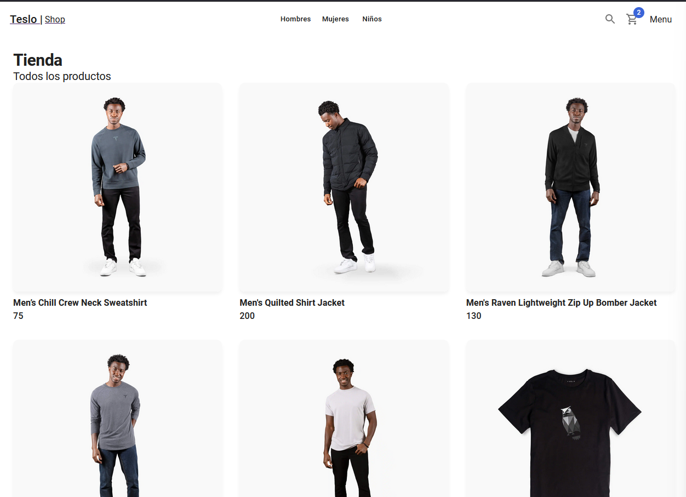

# Getting Started

First, run the development server:

```bash
npm run dev
# or
yarn dev
```

# Next.js - Open Jira app

Clon de Jira

Pendiente eliminación de entradas

## Configuararciones iniciales

- Reconstruir los modulos con `npm i`

    Importante agregar `mongo/` al gitignore

- Para correr localmente necesita la DDBB, tener docker desktop corriendo y ejecutar:

        docker compose up -d

- Para correr el proyecto - Se utilizo `yarn` o `npm`

      npm run dev
      # or
      yarn dev

   Open [localhost](http://localhost:3000) with your browser to see the result.

- Cadena de conexion con MongoDB local

      mongodb://localhost:27017/entriesdb

- Llenar la DDDBB con datos de prueba usando:

      GET - localhost://localhost:3000/api/seed

- LUEGO DE USAR EL COMANDO NO USES ESTE COMANDO O ELIMINA EL FILE /page/api/seed

- CDN en el _document

      <link
        rel="stylesheet"
        href="https://fonts.googleapis.com/css?family=Roboto:300,400,500,700&display=swap"
      />

- Configuarar variables de entorno

- MongoDB URL Local, para conexion con la base de datos.

      mongodb://localhost:27017/entriesdb

## Dependecias

    yarn add @mui/material @emotion/react @emotion/styled
    yarn add @mui/icons-material
    yarn add uuid
    yarn add notistack
    yarn add date-fns
    yarn add @mui/x-data-grid

## Enlaces

- [Material UI](https://mui.com/)
- [Drag & Drop react-beautiful-dnd](https://www.npmjs.com/package/react-beautiful-dnd)
- [Codigos de respuesta http](https://developer.mozilla.org/es/docs/Web/HTTP/Status)
- [Middleware Next](https://nextjs.org/docs/advanced-features/middleware)
- [Guia de migración Middleware Next](https://nextjs.org/docs/messages/middleware-upgrade-guide#breaking-changes)
- [Snackbar](https://mui.com/material-ui/react-snackbar/)
- [notistack - con Provider](https://github.com/iamhosseindhv/notistack)
- [date-fns](https://date-fns.org/)
- [Mui Grid](https://mui.com/x/react-data-grid/getting-started/#main-content)

## Vista previa


